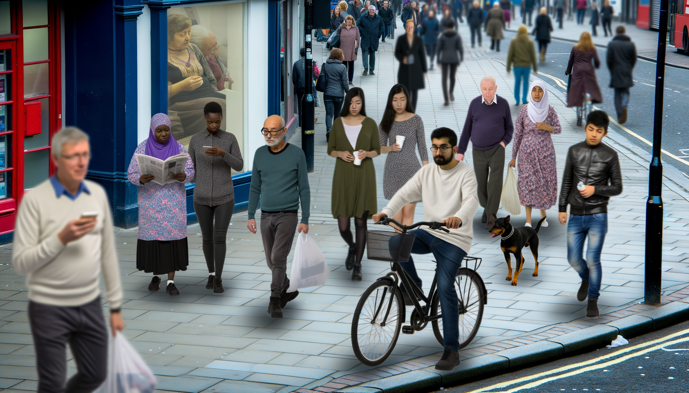

# Synthetic Data Generation


We are solving an pbejct detection taks, so we are working with images. And we tried two ways of generating data, the first:
- Generate annotatiopn by ChatGPT4o
- Generate photorealystic images by DALL-E 3


To do this install Openai Python SDK
```bash
pip install openai
```

## Generate annotations
Then run the labelling script
You have to provide ypur Openai API token there and the path to the folder with images and folder for predicitons in YOLO format
```bash
python annotat_dataset_by_gpt.py \
--api_key <YOUR_API_KEY> \
--images_dir /path/to/images/ \
--labels_dir /path/to/predictions/
```

As we can see on the image, the localization is very-very bad, but sometimes it can count number of objects right


## Generate images
Another way to generate data is to use DALL-E 3
To do this you have to run the following script
```bash
python generate_images.py \
--api_key <YOUR_API_KEY> \
--save_data_dir /path/to/save/data/
--prompt "A photo of a cat in a forest"
```

This way with DALL-E 3 didn'w work good, as well, because images are in different qulality, style and don't perfectly fit the prompt
As a prompt we used "A photorealistic footage of the steet with people", they can be founbd in the folder ./generated_images
Here is what DALL-E 3 generated. Not what we expected

